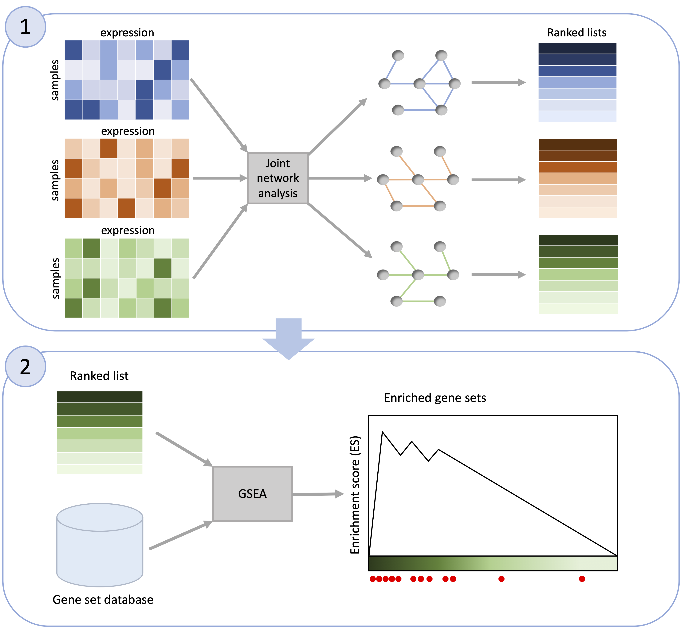
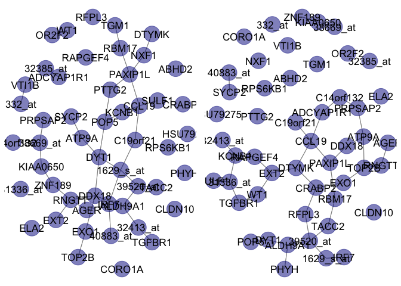

<!-- README.md is generated from README.Rmd. Please edit that file -->
<!-- badges: start -->

[](https://www.tidyverse.org/lifecycle/#experimental)
[](https://opensource.org/licenses/MIT)
<!--[](https://codecov.io/gh/Camiling/JoStARS) -->
<!--[](https://github.com/Camiling/JoStARS/actions) -->
[](https://github.com/Camiling/MultiNetEnrich/actions/workflows/R-CMD-check.yaml)
<!-- badges: end -->

<!-- IF ON CRAN []
[]---->
<!--PAPER HERE []---->

# `MultiNetEnrich` 

The `MultiNetEnrich` package implements functional network enrichment
analysis for multiple data sets. The method takes a list of data
matrices with a one-to-one correspondence between the variables, such as
different clinical groups or tissue types with the same set of genes
measured, or mRNA and protein encoded by the same genes. The method has
two steps; (i) network estimation and (ii) enrichment analysis based on
the results. In step (i), we use the joint graphical horseshoe for
multiple network estimation (Lingjærde et al. (2022)) to obtain one
network per group. The method borrows strength across shared patterns
while highlighting differences across networks, giving a reasonable
basis for comparisons. In step (ii), we use ranked gene set enrichment
analysis (GSEA) (Subramanian et al. (2005)) on each network, where genes
(or the proteins they encode) are ranked according to their node degree
in the respective networks to identify gene sets that are
over-represented by the most active or central genes or proteins in each
group in terms of associations. To identify enriched gene sets, we walk
through the ranked gene lists from top to bottom, investigating
different gene sets and pathways from the Molecular Signatures Database
(MSigDB).



## Installation

This package requires the network estimation packages `fastGHS`and
`jointGHS`, as well as the `GSEA` package to be installed. To install
the current development version of all packages, use

``` r
remotes::install_github("camiling/fastGHS")
remotes::install_github("camiling/jointGHS")
remotes::install_github("GSEA-MSigDB/GSEA_R")
remotes::install_github("camiling/MultiNetEnrich")
```

If you would like to install all packages of the models we currently
support, use

``` r
remotes::install_github("camiling/MultiNetEnrich", dependencies = TRUE)
```

If you would also like to build and view the vignette locally, use

``` r
remotes::install_github("camiling/MultiNetEnrich", dependencies = TRUE, build_vignettes = TRUE)
browseVignettes("MultiNetEnrich")
```

You might need to run the script for GSEA manually once before the
package can be used

``` r
source(system.file("extdata", "Run.GSEA.R", package = "GSEA"))
```

## Specifying gene sets

The default gene sets are Wikipathways, PID, and Hallmark, but any gene
set from MSigDb can be used. The gene sets to be used must be provided
through the `database` argument as one or more strings in the form of
the URLs listed
[here](https://data.broadinstitute.org/gsea-msigdb/msigdb/release/7.5.1/).

## Example

The main function `MultiNetEnrich` takes a list of $K$ data matrices,
each of dimension $n_k \times p$ where $n_k$ is the sample size of data
set $k$, for which separate functional network enrichment is to be
computed. Note that the column names must be gene names, so if you are
using protein data please convert the column names to the id of the gene
that encodes them.

The following example applies the method to gene expression data from a
study on acute leukemias; acute myeloid leukemia (AML) and acute
lymphoblastic leukemia (ALL) (Armstrong et al. (2002)). The output gives
us the gene sets found to be significantly enriched at $p<0.05$ and
false discovery rate $<25\%$.

``` r
# Download data
dat.leuk <- read.delim(
  file =
    "https://data.broadinstitute.org/gsea-msigdb/gsea/dataset_files/Leukemia_collapsed_symbols.gct",
  skip = 2
)
rownames(dat.leuk) <- dat.leuk[, 1]
dat.leuk <- dat.leuk[, -c(1:2)]
# Separate ALL and AML
leuk.type <- substr(colnames(dat.leuk), 1, 3)
dat.leuk.all <- dat.leuk[, leuk.type == "ALL"]
dat.leuk.aml <- dat.leuk[, leuk.type == "AML"]
# Select subset of transcriptomics for quick toy example
dat.leuk.all <- t(dat.leuk.all[1:50, ])
dat.leuk.aml <- t(dat.leuk.aml[1:50, ])
# Get gene names
gene.names <- unlist(lapply(colnames(dat.leuk.all),
  FUN = function(s) strsplit(s, split = "///")[[1]][1]
))
colnames(dat.leuk.all) <- gene.names
colnames(dat.leuk.aml) <- gene.names
# Final data
dim(dat.leuk.all)
dim(dat.leuk.aml)
X <- list(dat.leuk.all, dat.leuk.aml)

# Peform functional network enrichment
set.seed(1)
enrich.res <- MultiNetEnrich(X)
```

We can inspect the enriched gene sets

``` r
# Look at enriched gene sets for AML
enrich.res$enrichment.list[[2]][, c("GS", "SIZE", "NES", "NOM p-val", "FDR q-val")]
#>                    GS SIZE    NES NOM p-val FDR q-val
#> 1 HALLMARK_PEROXISOME    2 1.4702   0.02549    0.1225
#> 2 HALLMARK_GLYCOLYSIS    2 1.4645    0.0303  0.066042
```

The ranking of the genes can be printed for further inspection of the
top hubs.

``` r
# For AML
enrich.res$ranked.lists[[1]][1:5, ] # Print top five genes
#>         gene degree
#> 40   PAXIP1L      5
#> 39     CCL19      5
#> 37     RNGTT      5
#> 31 1629_s_at      5
#> 27     DDX18      5
```

The estimated networks can be visualised with functions from the
`network` and `ggnet2` libraries.

``` r
set.seed(1234)
net.all <- network::network(enrich.res$networks[[1]])
net.aml <- network::network(enrich.res$networks[[2]])
g.all <- GGally::ggnet2(net.all, alpha = 0.5, color = "darkblue", label = colnames(X[[1]]))
#> Registered S3 method overwritten by 'GGally':
#>   method from   
#>   +.gg   ggplot2
g.aml <- GGally::ggnet2(net.aml, alpha = 0.5, color = "darkblue", label = colnames(X[[1]]))
ggpubr::ggarrange(g.all, g.aml, ncol = 2, nrow = 1)
```



## Contribution

All feedback and suggestions are very welcome. If you have any questions
or comments, feel free to open an issue
[here](https://github.com/Camiling/MultiNetEnrich/issues).

## References

<div id="refs" class="references csl-bib-body hanging-indent">

<div id="ref-armstrong2002mll" class="csl-entry">

Armstrong, Scott A, Jane E Staunton, Lewis B Silverman, Rob Pieters,
Monique L den Boer, Mark D Minden, Stephen E Sallan, Eric S Lander, Todd
R Golub, and Stanley J Korsmeyer. 2002. “MLL Translocations Specify a
Distinct Gene Expression Profile That Distinguishes a Unique Leukemia.”
*Nature Genetics* 30 (1): 41–47.

</div>

<div id="ref-lingjaerde2022scalable" class="csl-entry">

Lingjærde, Camilla, Benjamin P Fairfax, Sylvia Richardson, and Hélène
Ruffieux. 2022. “Scalable Multiple Network Inference with the Joint
Graphical Horseshoe.” *arXiv Preprint arXiv:2206.11820*.

</div>

<div id="ref-subramanian2005gene" class="csl-entry">

Subramanian, Aravind, Pablo Tamayo, Vamsi K Mootha, Sayan Mukherjee,
Benjamin L Ebert, Michael A Gillette, Amanda Paulovich, et al. 2005.
“Gene Set Enrichment Analysis: A Knowledge-Based Approach for
Interpreting Genome-Wide Expression Profiles.” *Proceedings of the
National Academy of Sciences* 102 (43): 15545–50.

</div>

</div>
